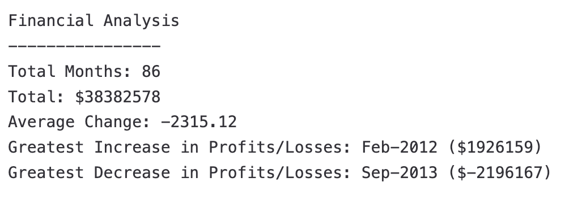

<h1>Console-Finances</h1>

This JavaScript project is designed to analyze a financial dataset provided as arrays containing Date and Profit/Losses fields. It performs calculations to derive key insights from the dataset.

# Features

Calculates the total number of months included in the dataset.
Computes the net total amount of Profit/Losses over the entire period.

Determines the average of the changes in Profit/Losses over the entire period.

Identifies the greatest increase in Profit/Losses (including date and amount) over the entire period.

Finds the greatest decrease in Profit/Losses (including date and amount) over the entire period.

# Instructions For This Assignment

Clone the Repository

Create a new GitHub repository called Console-Finances.
Clone the repository to your local machine.
Copy Starter Files

Copy the starter files provided in the local git repository.
Analyzing the Financial Dataset

Run the JavaScript code provided (index.js).
The resulting analysis will be displayed in the console.

# Outcome Example

## Contact Me

Feel free to reach out to me via:

- **Email**: harryhing2@gmail.com
- **LinkedIn**: [My LinkedIn Profile](https://www.linkedin.com/in/harry-hing-46a874207/)
- **Github**: [Github](https://github.com/harryh38)
